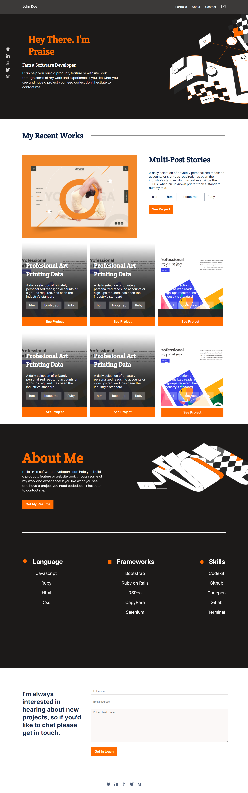

# Portfolio

> Portfolio
> 

Additional description about the project and its features.

## Built With

- HTML and CSS

## Getting Started

To get a local copy up and running follow these simple example steps.

- Open your terminal or command line 
- Clone the project using:

```
$ git clone https://github.com/praizerema/portfolio.git
```

### Prerequisites

- A text editor or and IDE
- Git installed

## Authors

👤 **Author1**

- GitHub: [@praizerema](https://github.com/praizerema)
- Twitter: [@ayodelepraisego](https://twitter.com/ayodelepraisego)
- LinkedIn: [Ayodele PraiseGod](https://www.linkedin.com/in/praizerema)

## 🤝 Contributing

Contributions, issues, and feature requests are welcome!

Feel free to check the [issues page](https://github.com/praizerema/portfolio/issues).

## Show your support

Give a ⭐️ if you like this project!

## Acknowledgments

- Hat tip to anyone whose code was used
- Inspiration
- etc

